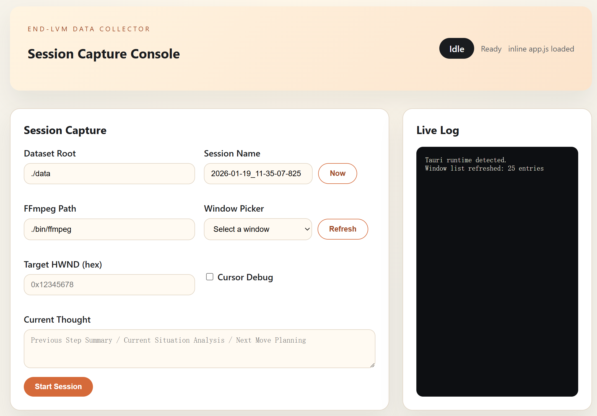

# End-VLM Data Collector



## What It Does
This project records synchronized gameplay video and input data for training
and evaluation. It captures a target window at the selected FPS (2/3/5),
aggregates RawInput events into matching step windows, and writes action strings
into a file.

## Run
Requirements: Windows, WGC & Webview2 Runtime

https://github.com/Chiicake/End-VLM-data-collector/releases/download/v0.1/vlm-data-collector-gui-win64.zip

下载解压之后直接运行collector-gui.exe

选择对应的收集窗口之后点击start即可开始工作

收集的文件夹默认为./sessions/{session_name}

### From release
```bash
Invoke-WebRequest -Uri "https://github.com/Chiicake/End-VLM-data-collector/releases/download/v0.1/vlm-data-collector-gui-win64.zip" -OutFile "vlm-data-collector-gui-win64.zip"
Expand-Archive -Path ".\vlm-data-collector-gui-win64.zip" -DestinationPath ".\" -Force
cd .\vlm-data-collector-gui-win64\
.\collector-gui.exe
```


Build from source (Windows, need rust toolchain):
```bash
git clone https://github.com/Chiicake/End-VLM-data-collector.git
cargo build -p gui --features tauri --release
move ./target/release/collector-gui.exe ./
./gui/collector-gui.exe
```

## Inputs
Realtime capture:
- Target HWND (window handle) chosen by GUI or CLI.
- Keyboard/mouse input via RawInput (foreground-only).

## Outputs
Each session is written under `dataset_root/sessions/<session_name>/`:
- `video.mp4` (2/3/5 FPS, 720p/480p, H.264)
- `actions.jsonl` (one snapshot per frame with `step_index`)
- `compiled_actions.jsonl` (one action string per frame)
- `labeling_instruct.jsonl` (aligned with `actions.jsonl`)
- `auto_events.jsonl` (reserved, empty by default)
- `options.json`, `meta.json`

## Notes & Constraints
- Windows 10 21H2+ / Windows 11, x64.
- Capture API is Windows Graphics Capture only.
- Recording FPS is selectable (2/3/5) in the GUI.
- Foreground-only input is enforced.
- Capture fails if the window is invalid, hidden, minimized, cloaked, or
  fullscreen-like.

## Input Events JSONL
Each line is a single `InputEvent` JSON object.

Examples:
```json
{"qpc_ts":10,"type":"key_down","key":"W"}
{"qpc_ts":20,"type":"key_up","key":"W"}
{"qpc_ts":30,"type":"mouse_move","dx":12,"dy":-5}
{"qpc_ts":40,"type":"mouse_wheel","delta":120}
{"qpc_ts":50,"type":"mouse_button","button":"left","is_down":true}
```

Notes:
- `type` values: `key_down`, `key_up`, `mouse_move`, `mouse_wheel`, `mouse_button`.
- `button` values: `left`, `right`, `middle`, `x1`, `x2`.
- `qpc_ts` should be in the same units used by the pipeline; the CLI treats it
  as an opaque timestamp and slices windows using `step_index * step_ms`.

## Timing Alignment
- The GUI Record FPS sets `capture.fps` and `timing.step_ms` (approx `1000 / fps`).
- `compiled_actions.jsonl` uses 6 bins per frame, so each `;` represents
  roughly `step_ms / 6` (e.g. 500ms per frame -> ~83ms per bin).
- `meta.json` now includes `record_fps` to make the chosen FPS explicit.
